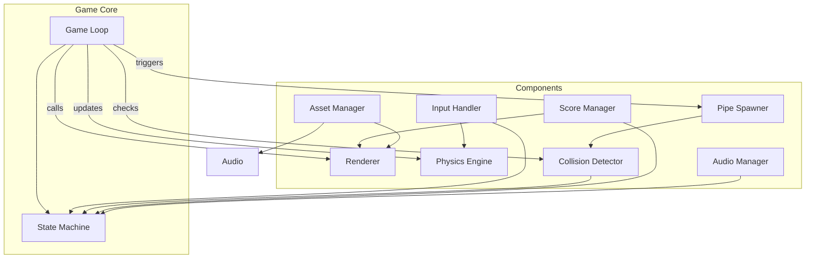
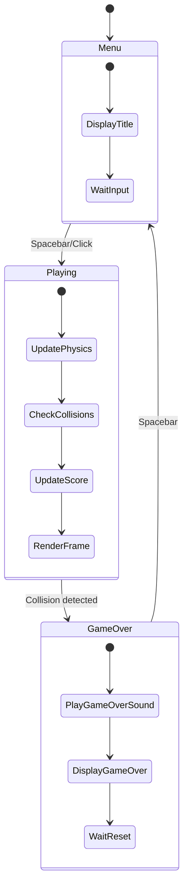
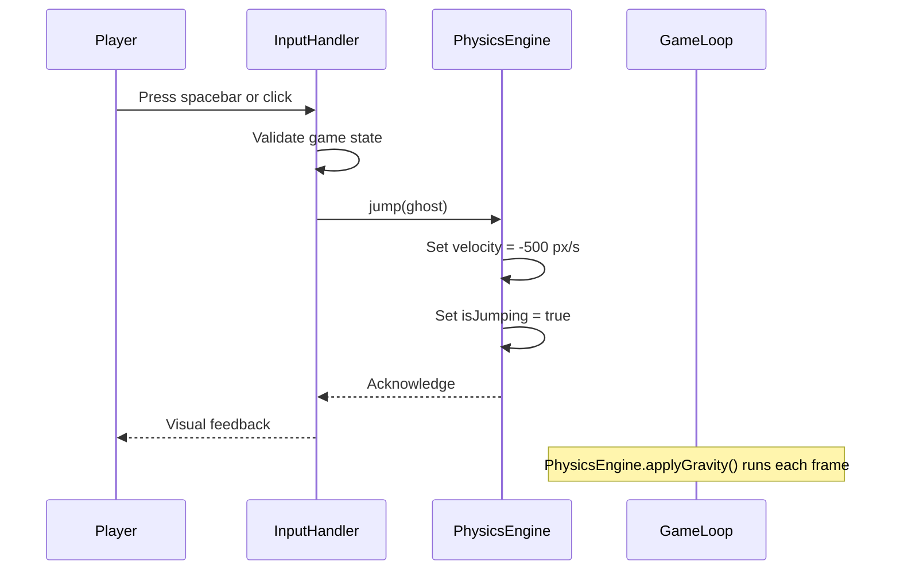
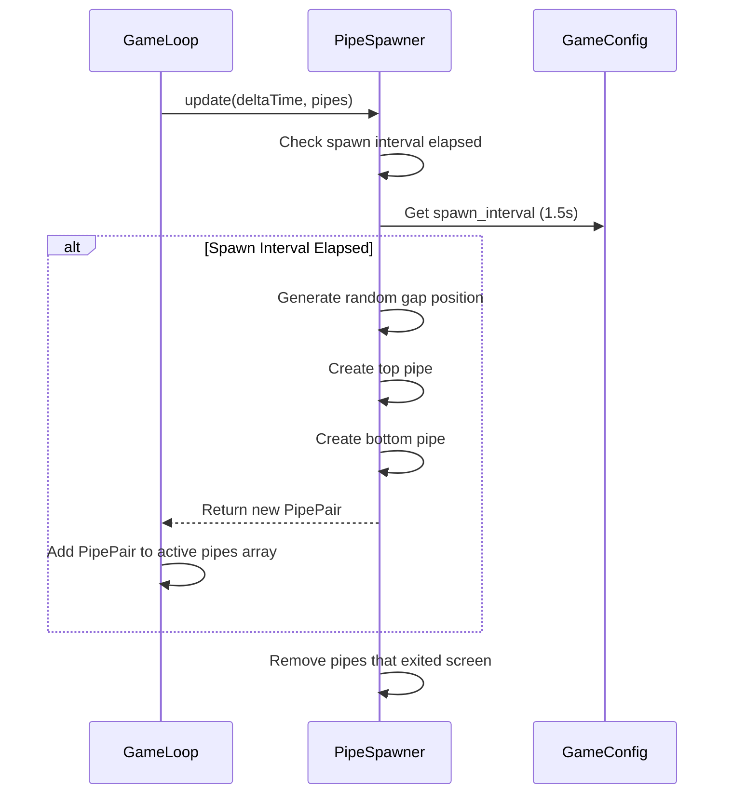
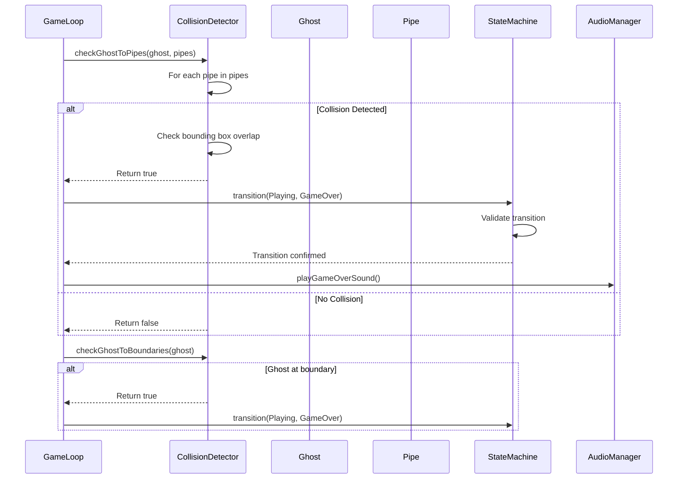
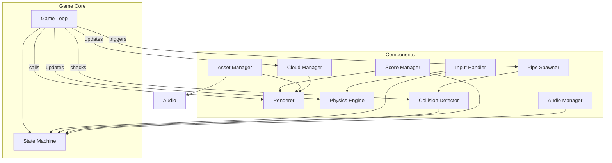
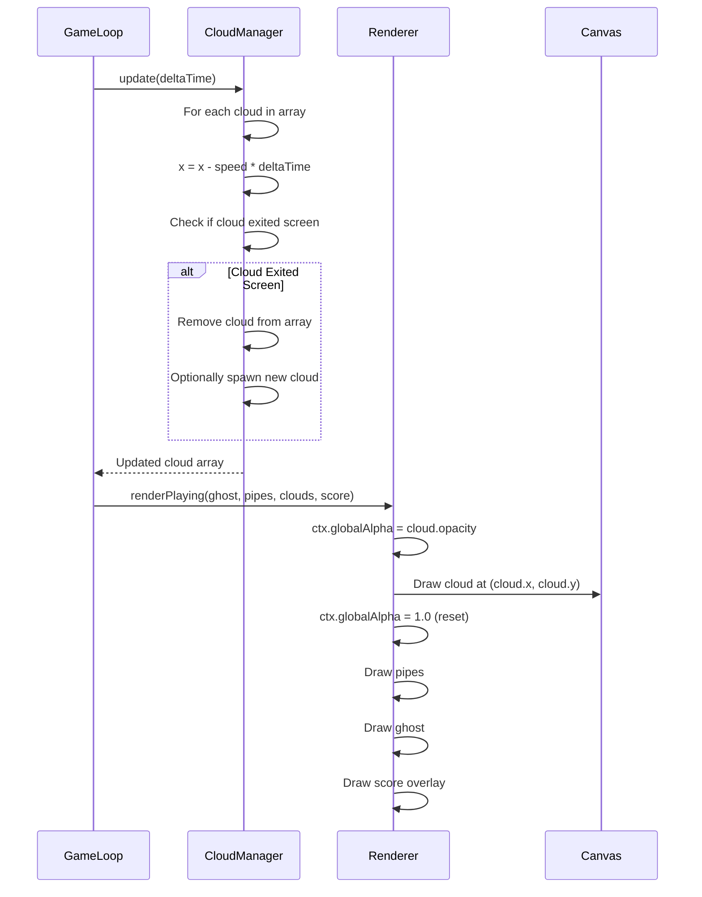
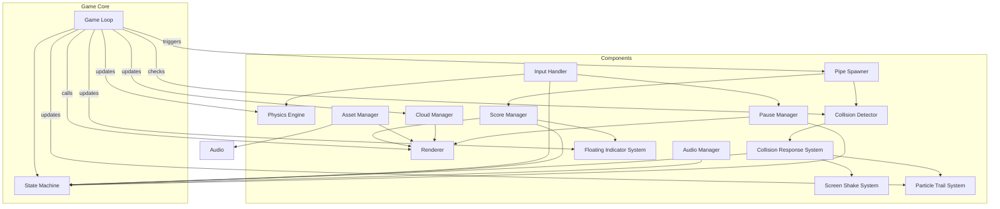
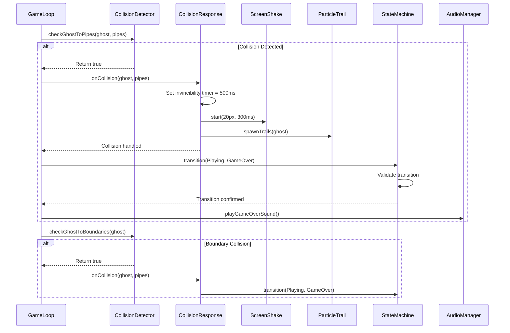
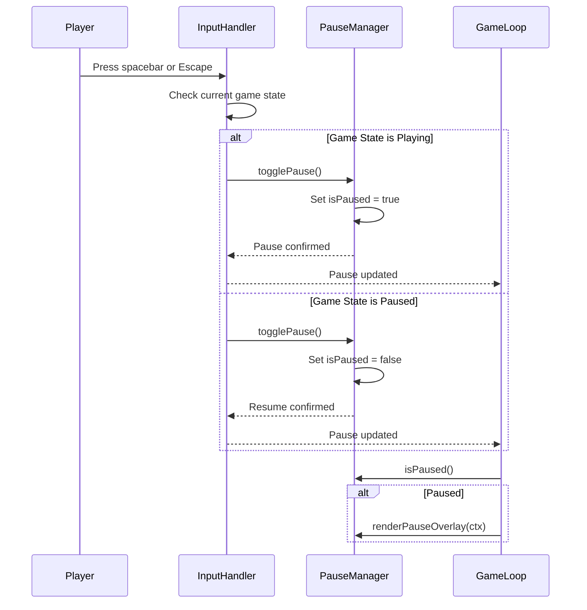

# Design Document: Flappy Kiro

## Overview

Flappy Kiro is a browser-based endless scroller game where players guide a ghost character through vertically oriented pipes. The game runs at 60 FPS using the Canvas API and requestAnimationFrame, featuring a state machine with Menu, Playing, and Game Over states.

**Technical Stack:**
- Canvas API for rendering
- requestAnimationFrame for game loop
- localStorage for high score persistence
- Web Audio API for sound playback
- Pure JavaScript with no external dependencies

---

## Architecture



### Component Interactions

```
┌─────────────────────────────────────────────────────────────────┐
│                         Game Loop (60 FPS)                      │
├─────────────────────────────────────────────────────────────────┤
│  1. InputHandler processes user input                           │
│  2. PhysicsEngine updates Ghost position                        │
│  3. PipeSpawner generates new pipes (if needed)                 │
│  4. CollisionDetector checks for collisions                     │
│  5. ScoreManager updates score (if passed pipes)                │
│  6. Renderer draws all elements                                 │
│  7. StateMachine validates state transitions                    │
└─────────────────────────────────────────────────────────────────┘
```

---

## Game Loop Implementation

The game loop uses `requestAnimationFrame` for smooth 60 FPS rendering:

```javascript
function gameLoop(timestamp) {
    const deltaTime = timestamp - lastTimestamp;
    
    // Limit frame time to prevent spiral of death
    if (deltaTime > 16.67 + 1) {
        console.error('Frame rate too slow');
        lastTimestamp = timestamp;
        requestAnimationFrame(gameLoop);
        return;
    }
    
    update(deltaTime);
    render();
    
    lastTimestamp = timestamp;
    requestAnimationFrame(gameLoop);
}
```

**Frame Timing:**
- Target: 16.67ms per frame (60 FPS)
- Threshold: 17.67ms (60 FPS - 1ms tolerance)
- If exceeded: Log error and continue to next frame

---

## State Machine Design



### State Transitions

| Current State | Trigger | Next State | Condition |
|---------------|---------|------------|-----------|
| Menu | Spacebar/Click | Playing | Valid transition |
| Playing | Collision | Game Over | Ghost touches pipe or boundary |
| Game Over | Spacebar | Menu | 100ms debounce passed |

### State Validation

- Invalid transitions are rejected and logged
- State is validated before each game loop iteration
- Default state on load: Menu

---

## Component Breakdown

### 1. AssetManager

**Responsibilities:**
- Load and cache game assets (images, audio)
- Validate asset format and dimensions
- Handle retry logic for failed loads

**Interface:**
```typescript
interface AssetManager {
    loadAssets(): Promise<void>
    getAsset(name: string): HTMLImageElement | HTMLAudioElement
    preload(): Promise<void>
}
```

**Asset Loading Strategy:**
- Load ghosty.png as HTMLImageElement
- Load jump.wav and game_over.wav as HTMLAudioElement
- Retry failed loads up to 3 times with 100ms delay
- Halt execution if assets fail to load after 3 retries

---

### 2. InputHandler

**Responsibilities:**
- Listen for spacebar and mouse click events
- Map input to game actions
- Debounce Game Over to Menu transition

**Interface:**
```typescript
interface InputHandler {
    addEventListener(callback: (action: 'jump' | 'start') => void): void
    removeEventListener(callback: () => void): void
}
```

**Event Mapping:**
- Spacebar (keydown) → 'jump' action
- Mouse click → 'jump' action
- Spacebar in Game Over → 'start' action (with 100ms debounce)

---

### 3. PhysicsEngine

**Responsibilities:**
- Calculate Ghost position based on gravity and velocity
- Apply constant gravity acceleration
- Update positions for all game entities

**Interface:**
```typescript
interface PhysicsEngine {
    update(ghost: Ghost, deltaTime: number): void
    jump(ghost: Ghost): void
    applyGravity(ghost: Ghost, deltaTime: number): void
}
```

**Physics Constants:**
- Gravity: -9.8 pixels/second² (downward acceleration)
- Jump velocity: -500 pixels/second (upward initial velocity)
- Pipe scroll speed: 100 pixels/second (right to left)

**Velocity Convention:**
- Negative values = upward movement
- Positive values = downward movement
- Jump state = period when vertical velocity is negative

---

### 4. PipeSpawner

**Responsibilities:**
- Generate pipe pairs at regular intervals
- Spawn pipes off-screen to the right
- Remove pipes that exit the left side of the screen

**Interface:**
```typescript
interface PipeSpawner {
    update(deltaTime: number, pipes: Pipe[]): void
    spawnPipePair(): PipePair
    shouldSpawn(): boolean
}
```

**Spawn Configuration:**
- Spawn interval: 1.5 seconds (only in Playing state)
- Pipe gap: 150 pixels ± 5 pixels
- Retry attempts: 3 with 100ms delay on failure
- No spawning in Menu or Game Over states

**Pipe Generation Logic:**
1. Check if spawn interval has elapsed
2. Generate random vertical offset for pipe gap
3. Create top and bottom pipe pair
4. Position pipes at screen right edge (x = 800)

---

### 5. CollisionDetector

**Responsibilities:**
- Detect collisions between Ghost and pipes
- Detect collisions between Ghost and screen boundaries
- Mark collision events for game state transition

**Interface:**
```typescript
interface CollisionDetector {
    checkGhostToPipes(ghost: Ghost, pipes: Pipe[]): boolean
    checkGhostToBoundaries(ghost: Ghost): boolean
    getCollisionBox(sprite: any): BoundingBox
}
```

**Collision Detection Strategy:**
- Pixel-perfect bounding box overlap detection
- Check all active pipes for collision
- Check top boundary (y = 0) and bottom boundary (y = screen_height)
- Preserve Ghost coordinates at collision position

---

### 6. ScoreManager

**Responsibilities:**
- Track score during gameplay
- Update high score in localStorage
- Manage score display

**Interface:**
```typescript
interface ScoreManager {
    incrementScore(pipe: Pipe): void
    getHighScore(): number
    saveScore(score: number): void
    reset(): void
}
```

**Scoring Logic:**
- Increment when Ghost center x-coordinate passes pipe center x-coordinate
- Mark pipe as scored to prevent duplication
- High score persisted to localStorage across sessions

---

### 7. AudioManager

**Responsibilities:**
- Play sound effects at appropriate times
- Preload audio assets before game starts
- Limit sound effects to one per frame

**Interface:**
```typescript
interface AudioManager {
    playJumpSound(): void
    playGameOverSound(): void
    preload(): Promise<void>
    playOneSoundPerFrame(): void
}
```

**Audio Configuration:**
- Jump sound duration: 0.3 seconds
- Game over sound duration: 1.5 seconds
- At most one sound effect per frame
- Continue operation if sound fails to load (with error log)

---

### 8. Renderer

**Responsibilities:**
- Draw all game elements to Canvas
- Handle rendering for each game state
- Maintain minimum 30 FPS for visual smoothness

**Interface:**
```typescript
interface Renderer {
    renderMenu(): void
    renderPlaying(ghost: Ghost, pipes: Pipe[], score: number): void
    renderGameOver(score: number, highScore: number): void
    clearCanvas(): void
}
```

**Rendering Order (Z-index):**
1. Background (optional)
2. Pipes
3. Ghost
4. Score display (overlay)

**Visual Elements:**
- Title "Flappy Kiro" at center X, y = 25% screen height (Menu)
- Ghost at x = 50px, y = 50% screen height (Playing)
- Score counter at upper center, 24-point font (Playing)
- "Game Over" at center X, y = 30% and final score at y = 50% (Game Over)

---

## Data Structures

### Ghost

```typescript
interface Ghost {
    x: number;              // Horizontal position (fixed at 50px)
    y: number;              // Vertical position (50% screen height initially)
    velocity: number;       // Vertical velocity in pixels/second
    width: number;          // Sprite width
    height: number;         // Sprite height
    isJumping: boolean;     // Current jump state
}
```

### Pipe

```typescript
interface Pipe {
    id: string;             // Unique identifier for scoring
    x: number;              // Horizontal position
    topPipeHeight: number;  // Height of top pipe
    bottomPipeY: number;    // Y position of bottom pipe
    width: number;          // Pipe width (40-60 pixels)
    gap: number;            // Gap between pipes (150 pixels ± 5)
    scored: boolean;        // Whether this pipe has been scored
}
```

### PipePair

```typescript
interface PipePair {
    topPipe: Pipe;
    bottomPipe: Pipe;
    spawnTime: number;
}
```

### GameConfig

```typescript
interface GameConfig {
    screen_width: number;   // 800 pixels
    screen_height: number;  // 600 pixels
    gravity: number;        // -9.8 pixels/second²
    jump_velocity: number;  // -500 pixels/second
    pipe_scroll_speed: number; // 100 pixels/second
    spawn_interval: number; // 1.5 seconds
    pipe_gap: number;       // 150 pixels
    ghost_x: number;        // 50 pixels
    ghost_initial_y: number; // 50% screen height
}
```

### BoundingBox

```typescript
interface BoundingBox {
    x: number;              // Top-left x coordinate
    y: number;              // Top-left y coordinate
    width: number;          // Width of box
    height: number;         // Height of box
}
```

---

## Sequence Diagrams

### Jump Sequence



### Pipe Generation Sequence



### Collision Detection Sequence



---

## Technical Implementation Details

### Canvas API

```javascript
// Canvas setup
const canvas = document.getElementById('gameCanvas');
const ctx = canvas.getContext('2d');
canvas.width = 800;
canvas.height = 600;

// Rendering
ctx.drawImage(image, x, y, width, height);
ctx.font = '24px Arial';
ctx.fillStyle = '#FFFFFF';
ctx.fillText(text, x, y);
```

### requestAnimationFrame

```javascript
let lastTimestamp = 0;

function gameLoop(timestamp) {
    const deltaTime = timestamp - lastTimestamp;
    
    // Frame time validation
    if (deltaTime > 17.67) {
        console.error('Frame rate too slow');
    }
    
    update(deltaTime);
    render();
    
    lastTimestamp = timestamp;
    requestAnimationFrame(gameLoop);
}

requestAnimationFrame(gameLoop);
```

### localStorage

```javascript
// High score persistence
const HIGH_SCORE_KEY = 'flappyKiro_highScore';

function getHighScore() {
    const stored = localStorage.getItem(HIGH_SCORE_KEY);
    return stored ? parseInt(stored, 10) : 0;
}

function saveScore(score) {
    const currentHigh = getHighScore();
    if (score > currentHigh) {
        localStorage.setItem(HIGH_SCORE_KEY, score.toString());
    }
}
```

### Web Audio API

```javascript
// Audio playback
const jumpSound = new Audio('assets/jump.wav');
const gameOverSound = new Audio('assets/game_over.wav');

function playJumpSound() {
    jumpSound.currentTime = 0;
    jumpSound.play().catch(err => console.error('Audio play failed:', err));
}
```

### Asset Loading

```javascript
// Image loading with retry
function loadImage(src, retries = 3): Promise<HTMLImageElement> {
    return new Promise((resolve, reject) => {
        const img = new Image();
        img.src = src;
        img.onload = () => resolve(img);
        
        let attempts = 0;
        img.onerror = () => {
            attempts++;
            if (attempts >= retries) {
                reject(new Error(`Failed to load ${src}`));
            } else {
                setTimeout(() => img.src = src, 100);
            }
        };
    });
}
```

---

## Error Handling

### Asset Loading Errors
- Retry up to 3 times with 100ms delay
- Display error message and halt if all retries fail
- Log error details to console

### Frame Rate Errors
- Log error if frame exceeds 17.67ms
- Continue to next frame (do not skip)
- Prevents spiral of death

### Audio Errors
- Log error if sound fails to play
- Continue operation without that sound effect
- Allow game to function without audio

### Collision Detection Errors
- Gracefully handle missing collision data
- Default to no collision if detection fails
- Log unexpected error conditions

---

## Testing Strategy

### Unit Tests
- PhysicsEngine: Test gravity calculations and jump physics
- PipeSpawner: Test spawn timing and pipe generation
- CollisionDetector: Test bounding box overlap detection
- ScoreManager: Test score increment and high score persistence

### Integration Tests
- Full game loop execution (100+ iterations)
- State transitions (Menu → Playing → Game Over → Menu)
- Asset loading and audio playback

### Property-Based Tests
- **Property 1**: Ghost position after jump follows parabolic trajectory
- **Property 2**: All pipes scroll at constant speed
- **Property 3**: Score increments exactly once per pipe pass
- **Property 4**: High score is always >= current score

---

## Implementation Notes

1. **Frame Time Management**: Always validate frame time to prevent performance degradation

2. **Coordinate System**: Canvas origin (0,0) is top-left; positive Y is downward

3. **Z-Order**: Render pipes before ghost, score as overlay

4. **Memory Management**: Remove off-screen pipes from active array

5. **Performance**: Use object pooling for pipes if needed

6. **Accessibility**: Consider keyboard-only navigation support

7. **Cross-Browser**: Test with requestAnimationFrame vendor prefixes if needed

---

## File Structure

```
kiro-introduction/
├── assets/
│   ├── ghosty.png
│   ├── jump.wav
│   └── game_over.wav
├── index.html
└── game.js (main game implementation)
```

### index.html
- Canvas element with id="gameCanvas"
- Basic styling and layout
- Script reference to game.js

### game.js
- Game loop implementation
- Component classes and interfaces
- Asset loading and management
- Input handling
- State machine logic
- Rendering functions

---

## Cloud System Design

### Cloud Interface

```typescript
interface Cloud {
    x: number;              // Horizontal position (pixels)
    y: number;              // Vertical position (pixels)
    opacity: number;        // Opacity (0.3-0.7 for visibility)
    speed: number;          // Scroll speed (30-60 pixels/second)
    width: number;          // Cloud width (pixels)
    height: number;         // Cloud height (pixels)
}
```

### Cloud Configuration

```typescript
interface CloudConfig {
    minOpacity: number;     // Minimum opacity (0.3)
    maxOpacity: number;     // Maximum opacity (0.7)
    minSpeed: number;       // Minimum scroll speed (30 px/s)
    maxSpeed: number;       // Maximum scroll speed (60 px/s)
    spawnInterval: number;  // Time between cloud spawns (seconds)
    cloudCount: number;     // Maximum number of clouds on screen
}
```

### CloudManager Component

**Responsibilities:**
- Manage cloud array with spawn, update, and render operations
- Implement parallax scrolling with different speed layers
- Generate clouds with random Y positions and varying opacities
- Handle cloud removal when they exit the screen

**Interface:**
```typescript
interface CloudManager {
    update(deltaTime: number): void
    render(ctx: CanvasRenderingContext2D): void
    spawnCloud(): Cloud
    getClouds(): Cloud[]
}
```

**Cloud Generation Strategy:**
1. Randomize Y position within screen bounds (preserving pipe space)
2. Randomize opacity between 0.3-0.7
3. Randomize speed between 30-60 pixels/second
4. Randomize cloud width and height for variety
5. Position clouds off-screen to the right initially

**Parallax Scrolling Implementation:**
- Clouds move slower than pipes (30-60 px/s vs 100 px/s)
- Creates depth perception effect
- Different cloud layers can have different speeds

**Rendering Order:**
1. Clouds (background layer)
2. Pipes
3. Ghost
4. Score (overlay layer)

---

## Enhanced Physics System

### Updated Ghost Interface

```typescript
interface Ghost {
    x: number;              // Horizontal position (fixed at 50px)
    y: number;              // Vertical position (50% screen height initially)
    velocity: number;       // Vertical velocity in pixels/second
    terminalVelocity: number; // Maximum velocity (downward: 800, upward: -600)
    previousPosition: number; // Previous frame position for interpolation
    width: number;          // Sprite width
    height: number;         // Sprite height
    isJumping: boolean;     // Current jump state
    interpolationFactor: number; // Interpolation factor (0-1)
}
```

### PhysicsEngine Enhancement

**Responsibilities:**
- Calculate Ghost position with terminal velocity limits
- Implement momentum conservation with velocity smoothing
- Frame interpolation for smooth movement

**Updated Interface:**
```typescript
interface PhysicsEngine {
    update(ghost: Ghost, deltaTime: number): void
    jump(ghost: Ghost): void
    applyGravity(ghost: Ghost, deltaTime: number): void
    updateWithInterpolation(ghost: Ghost, deltaTime: number): number
    clampVelocity(velocity: number): number
}
```

**Terminal Velocity Limits:**
- Upward: -600 pixels/second (maximum jump speed)
- Downward: +800 pixels/second (maximum fall speed)

**Velocity Clamping Logic:**
```javascript
function clampVelocity(velocity: number): number {
    const minVelocity = -600; // Terminal velocity upward
    const maxVelocity = 800;  // Terminal velocity downward
    
    if (velocity < minVelocity) return minVelocity;
    if (velocity > maxVelocity) return maxVelocity;
    return velocity;
}
```

**Frame Interpolation:**
```javascript
// Calculate interpolation factor based on frame timing
function calculateInterpolationFactor(deltaTime: number, targetFPS: number = 16.67): number {
    return Math.min(deltaTime / targetFPS, 1.0);
}

// Update position with interpolation
function updateWithInterpolation(ghost: Ghost, deltaTime: number): number {
    // Store previous position
    ghost.previousPosition = ghost.y;
    
    // Calculate current position
    const currentY = ghost.y + ghost.velocity * (deltaTime / 1000);
    
    // Calculate interpolation factor
    ghost.interpolationFactor = calculateInterpolationFactor(deltaTime);
    
    // Apply interpolation: position = previous + (current - previous) * factor
    const interpolatedPosition = ghost.previousPosition + 
                                  (currentY - ghost.previousPosition) * 
                                  ghost.interpolationFactor;
    
    return interpolatedPosition;
}
```

**Updated Update Method:**
```javascript
function update(ghost: Ghost, deltaTime: number): void {
    // Apply gravity
    applyGravity(ghost, deltaTime);
    
    // Clamp velocity to terminal velocity limits
    ghost.velocity = clampVelocity(ghost.velocity);
    
    // Update position with interpolation
    const interpolatedY = updateWithInterpolation(ghost, deltaTime);
    ghost.y = interpolatedY;
}
```

---

## Updated Component Architecture

### CloudManager Integration

**New Architecture:**


### Updated Component Interactions

```
┌─────────────────────────────────────────────────────────────────┐
│                         Game Loop (60 FPS)                      │
├─────────────────────────────────────────────────────────────────┤
│  1. InputHandler processes user input                           │
│  2. PhysicsEngine updates Ghost position                        │
│  3. CloudManager updates cloud positions                        │
│  4. PipeSpawner generates new pipes (if needed)                 │
│  5. CollisionDetector checks for collisions                     │
│  6. ScoreManager updates score (if passed pipes)                │
│  7. Renderer draws all elements                                 │
│     a. Clouds (background)                                      │
│     b. Pipes                                                    │
│     c. Ghost                                                    │
│     d. Score (overlay)                                          │
│  8. StateMachine validates state transitions                    │
└─────────────────────────────────────────────────────────────────┘
```

### Cloud Generation and Rendering Sequence



---

## Technical Implementation

### CloudManager Class

```typescript
class CloudManager implements CloudManager {
    private clouds: Cloud[] = [];
    private config: CloudConfig;
    
    constructor(config: CloudConfig) {
        this.config = {
            minOpacity: 0.3,
            maxOpacity: 0.7,
            minSpeed: 30,
            maxSpeed: 60,
            spawnInterval: 3, // seconds
            cloudCount: 5,
            ...config
        };
    }
    
    update(deltaTime: number): void {
        const deltaTimeSeconds = deltaTime / 1000;
        
        // Update all clouds
        this.clouds.forEach(cloud => {
            cloud.x -= cloud.speed * deltaTimeSeconds;
        });
        
        // Remove clouds that have exited screen
        this.clouds = this.clouds.filter(cloud => cloud.x + cloud.width > 0);
        
        // Spawn new clouds if needed
        this.spawnCloudsIfNecessary();
    }
    
    render(ctx: CanvasRenderingContext2D): void {
        this.clouds.forEach(cloud => {
            ctx.save();
            ctx.globalAlpha = cloud.opacity;
            ctx.fillStyle = '#FFFFFF';
            
            // Draw cloud as ellipse
            ctx.beginPath();
            ctx.ellipse(
                cloud.x + cloud.width / 2,
                cloud.y + cloud.height / 2,
                cloud.width / 2,
                cloud.height / 2,
                0,
                0,
                Math.PI * 2
            );
            ctx.fill();
            ctx.restore();
        });
    }
    
    spawnCloud(): Cloud {
        const screen_height = 600;
        const cloud_width = 60 + Math.random() * 40;
        const cloud_height = 30 + Math.random() * 20;
        
        return {
            x: 800, // Start off-screen right
            y: Math.random() * (screen_height - 100) + 50,
            opacity: Math.random() * (this.config.maxOpacity - this.config.minOpacity) + this.config.minOpacity,
            speed: Math.random() * (this.config.maxSpeed - this.config.minSpeed) + this.config.minSpeed,
            width: cloud_width,
            height: cloud_height
        };
    }
    
    private spawnCloudsIfNecessary(): void {
        if (this.clouds.length < this.config.cloudCount) {
            if (Math.random() < 0.02) { // Small chance per frame
                this.clouds.push(this.spawnCloud());
            }
        }
    }
    
    getClouds(): Cloud[] {
        return this.clouds;
    }
}
```

### PhysicsEngine with Interpolation

```typescript
class PhysicsEngine implements PhysicsEngine {
    private readonly GRAVITY = -9.8;
    private readonly JUMP_VELOCITY = -500;
    private readonly TERMINAL_VELOCITY_UPWARD = -600;
    private readonly TERMINAL_VELOCITY_DOWNWARD = 800;
    
    update(ghost: Ghost, deltaTime: number): void {
        // Apply gravity
        this.applyGravity(ghost, deltaTime);
        
        // Clamp velocity to terminal velocity limits
        ghost.velocity = this.clampVelocity(ghost.velocity);
        
        // Update position with interpolation
        const interpolatedY = this.updateWithInterpolation(ghost, deltaTime);
        ghost.y = interpolatedY;
    }
    
    jump(ghost: Ghost): void {
        ghost.velocity = this.JUMP_VELOCITY;
    }
    
    applyGravity(ghost: Ghost, deltaTime: number): void {
        const deltaTimeSeconds = deltaTime / 1000;
        ghost.velocity += this.GRAVITY * deltaTimeSeconds;
    }
    
    updateWithInterpolation(ghost: Ghost, deltaTime: number): number {
        // Store previous position
        ghost.previousPosition = ghost.y;
        
        // Calculate current position
        const deltaTimeSeconds = deltaTime / 1000;
        const currentY = ghost.y + ghost.velocity * deltaTimeSeconds;
        
        // Calculate interpolation factor
        const targetFPS = 16.67;
        ghost.interpolationFactor = Math.min(deltaTime / targetFPS, 1.0);
        
        // Apply interpolation
        const interpolatedPosition = ghost.previousPosition + 
                                      (currentY - ghost.previousPosition) * 
                                      ghost.interpolationFactor;
        
        return interpolatedPosition;
    }
    
    clampVelocity(velocity: number): number {
        if (velocity < this.TERMINAL_VELOCITY_UPWARD) {
            return this.TERMINAL_VELOCITY_UPWARD;
        }
        if (velocity > this.TERMINAL_VELOCITY_DOWNWARD) {
            return this.TERMINAL_VELOCITY_DOWNWARD;
        }
        return velocity;
    }
}
```

### Renderer with Cloud Support

```typescript
interface Renderer {
    renderMenu(): void
    renderPlaying(ghost: Ghost, pipes: Pipe[], clouds: Cloud[], score: number): void
    renderGameOver(score: number, highScore: number): void
    clearCanvas(): void
}
```

```javascript
renderPlaying(ghost: Ghost, pipes: Pipe[], clouds: Cloud[], score: number): void {
    // 1. Draw clouds (background layer)
    clouds.forEach(cloud => {
        ctx.save();
        ctx.globalAlpha = cloud.opacity;
        ctx.fillStyle = '#FFFFFF';
        
        // Draw cloud shape
        ctx.beginPath();
        ctx.ellipse(
            cloud.x + cloud.width / 2,
            cloud.y + cloud.height / 2,
            cloud.width / 2,
            cloud.height / 2,
            0,
            0,
            Math.PI * 2
        );
        ctx.fill();
        ctx.restore();
    });
    
    // 2. Draw pipes
    pipes.forEach(pipe => {
        ctx.fillStyle = '#228B22';
        ctx.fillRect(pipe.x, 0, pipe.width, pipe.topPipeHeight);
        ctx.fillRect(pipe.x, pipe.bottomPipeY, pipe.width, screen_height - pipe.bottomPipeY);
    });
    
    // 3. Draw ghost
    ctx.drawImage(
        assetManager.getAsset('ghosty'),
        ghost.x,
        ghost.y,
        ghost.width,
        ghost.height
    );
    
    // 4. Draw score (overlay)
    ctx.font = '24px Arial';
    ctx.fillStyle = '#FFFFFF';
    ctx.fillText(`Score: ${score}`, 10, 30);
}
```
---

## Components and Interfaces

This section defines all component interfaces with their method signatures for the Flappy Kiro game.

### Core Game Components

#### AssetManager

**Responsibilities:**
- Load and cache game assets (images, audio)
- Validate asset format and dimensions
- Handle retry logic for failed loads

**Interface:**
```typescript
interface AssetManager {
    loadAssets(): Promise<void>
    getAsset(name: string): HTMLImageElement | HTMLAudioElement
    preload(): Promise<void>
    hasAsset(name: string): boolean
}
```

#### InputHandler

**Responsibilities:**
- Listen for spacebar and mouse click events
- Map input to game actions
- Debounce Game Over to Menu transition

**Interface:**
```typescript
interface InputHandler {
    addEventListener(callback: (action: 'jump' | 'start') => void): void
    removeEventListener(callback: () => void): void
    isJumping(): boolean
    isStarted(): boolean
}
```

#### PhysicsEngine

**Responsibilities:**
- Calculate Ghost position based on gravity and velocity
- Apply constant gravity acceleration
- Update positions for all game entities
- Implement terminal velocity limits and frame interpolation

**Interface:**
```typescript
interface PhysicsEngine {
    update(ghost: Ghost, deltaTime: number): void
    jump(ghost: Ghost): void
    applyGravity(ghost: Ghost, deltaTime: number): void
    updateWithInterpolation(ghost: Ghost, deltaTime: number): number
    clampVelocity(velocity: number): number
    getPosition(ghost: Ghost): number
}
```

#### PipeSpawner

**Responsibilities:**
- Generate pipe pairs at regular intervals
- Spawn pipes off-screen to the right
- Remove pipes that exit the left side of the screen

**Interface:**
```typescript
interface PipeSpawner {
    update(deltaTime: number, pipes: Pipe[]): void
    spawnPipePair(): PipePair
    shouldSpawn(deltaTime: number): boolean
    getSpawnTimer(): number
    resetSpawnTimer(): void
}
```

#### CollisionDetector

**Responsibilities:**
- Detect collisions between Ghost and pipes
- Detect collisions between Ghost and screen boundaries
- Mark collision events for game state transition

**Interface:**
```typescript
interface CollisionDetector {
    checkGhostToPipes(ghost: Ghost, pipes: Pipe[]): boolean
    checkGhostToBoundaries(ghost: Ghost, screen_height: number): boolean
    getCollisionBox(sprite: Ghost | Pipe): BoundingBox
    checkCollision boxes(box1: BoundingBox, box2: BoundingBox): boolean
}
```

#### ScoreManager

**Responsibilities:**
- Track score during gameplay
- Update high score in localStorage
- Manage score display

**Interface:**
```typescript
interface ScoreManager {
    incrementScore(pipe: Pipe): void
    getHighScore(): number
    saveScore(score: number): void
    reset(): void
    getScore(): number
    isPipeScored(pipeId: string): boolean
    markPipeScored(pipeId: string): void
}
```

#### AudioManager

**Responsibilities:**
- Play sound effects at appropriate times
- Preload audio assets before game starts
- Limit sound effects to one per frame

**Interface:**
```typescript
interface AudioManager {
    playJumpSound(): void
    playGameOverSound(): void
    preload(): Promise<void>
    playOneSoundPerFrame(): void
    enable(): void
    disable(): void
    isEnabled(): boolean
}
```

#### Renderer

**Responsibilities:**
- Draw all game elements to Canvas
- Handle rendering for each game state
- Maintain minimum 30 FPS for visual smoothness

**Interface:**
```typescript
interface Renderer {
    renderMenu(): void
    renderPlaying(ghost: Ghost, pipes: Pipe[], clouds: Cloud[], score: number): void
    renderGameOver(score: number, highScore: number): void
    clearCanvas(): void
    drawCloud(cloud: Cloud): void
    drawPipe(pipe: Pipe): void
    drawGhost(ghost: Ghost): void
    drawScore(score: number, highScore: number): void
    drawGameOver(score: number, highScore: number): void
    drawTitle(): void
}
```

#### CloudManager

**Responsibilities:**
- Manage cloud array with spawn, update, and render operations
- Implement parallax scrolling with different speed layers
- Generate clouds with random Y positions and varying opacities
- Handle cloud removal when they exit the screen

**Interface:**
```typescript
interface CloudManager {
    update(deltaTime: number): void
    render(ctx: CanvasRenderingContext2D): void
    spawnCloud(): Cloud
    getClouds(): Cloud[]
    addCloud(cloud: Cloud): void
    removeCloud(cloud: Cloud): void
}
```

#### StateMachine

**Responsibilities:**
- Manage game state transitions (Menu, Playing, GameOver)
- Validate state transitions
- Trigger state-specific entry/exit actions

**Interface:**
```typescript
interface StateMachine {
    getCurrentState(): GameState
    transition(newState: GameState): boolean
    isValidTransition(current: GameState, next: GameState): boolean
    executeStateActions(): void
    reset(): void
}
```

### Configuration Interfaces

#### GameConfig

```typescript
interface GameConfig {
    screen_width: number;           // 800 pixels
    screen_height: number;          // 600 pixels
    gravity: number;                // -9.8 pixels/second²
    jump_velocity: number;          // -500 pixels/second
    pipe_scroll_speed: number;      // 100 pixels/second
    spawn_interval: number;         // 1.5 seconds
    pipe_gap: number;               // 150 pixels
    ghost_x: number;                // 50 pixels
    ghost_initial_y: number;        // 50% screen height
    terminal_velocity_upward: number;   // -600 pixels/second
    terminal_velocity_downward: number; // 800 pixels/second
    target_fps: number;             // 60 FPS
}
```

#### CloudConfig

```typescript
interface CloudConfig {
    minOpacity: number;         // Minimum opacity (0.3)
    maxOpacity: number;         // Maximum opacity (0.7)
    minSpeed: number;           // Minimum scroll speed (30 px/s)
    maxSpeed: number;           // Maximum scroll speed (60 px/s)
    spawnInterval: number;      // Time between cloud spawns (seconds)
    cloudCount: number;         // Maximum number of clouds on screen
}
```

---

## Data Models

This section defines all data structures with TypeScript interfaces used in the Flappy Kiro game.

### Game Entities

#### Ghost

```typescript
interface Ghost {
    x: number;                  // Horizontal position (fixed at 50px)
    y: number;                  // Vertical position (50% screen height initially)
    velocity: number;           // Vertical velocity in pixels/second
    terminalVelocity: number;   // Maximum velocity (downward: 800, upward: -600)
    previousPosition: number;   // Previous frame position for interpolation
    width: number;              // Sprite width
    height: number;             // Sprite height
    isJumping: boolean;         // Current jump state
    interpolationFactor: number; // Interpolation factor (0-1)
}
```

#### Cloud

```typescript
interface Cloud {
    x: number;                  // Horizontal position (pixels)
    y: number;                  // Vertical position (pixels)
    opacity: number;            // Opacity (0.3-0.7 for visibility)
    speed: number;              // Scroll speed (30-60 pixels/second)
    width: number;              // Cloud width (pixels)
    height: number;             // Cloud height (pixels)
}
```

#### Pipe

```typescript
interface Pipe {
    id: string;                 // Unique identifier for scoring
    x: number;                  // Horizontal position
    topPipeHeight: number;      // Height of top pipe
    bottomPipeY: number;        // Y position of bottom pipe
    width: number;              // Pipe width (40-60 pixels)
    gap: number;                // Gap between pipes (150 pixels ± 5)
    scored: boolean;            // Whether this pipe has been scored
}
```

#### PipePair

```typescript
interface PipePair {
    topPipe: Pipe;
    bottomPipe: Pipe;
    spawnTime: number;
}
```

### Collision and Bounds

#### BoundingBox

```typescript
interface BoundingBox {
    x: number;                  // Top-left x coordinate
    y: number;                  // Top-left y coordinate
    width: number;              // Width of box
    height: number;             // Height of box
}
```

### Game State

#### GameState

```typescript
type GameState = 'Menu' | 'Playing' | 'GameOver';
```

#### GameContext

```typescript
interface GameContext {
    ghost: Ghost;
    pipes: Pipe[];
    clouds: Cloud[];
    score: number;
    highScore: number;
    gameState: GameState;
    deltaTime: number;
    timestamp: number;
}
```

### Utility Types

#### Callback Types

```typescript
type JumpCallback = (ghost: Ghost) => void;
type CollisionCallback = (ghost: Ghost, pipes: Pipe[]) => boolean;
type ScoreCallback = (score: number) => void;
type StateChangeCallback = (newState: GameState) => void;
```

#### Input Actions

```typescript
type InputAction = 'jump' | 'start';
```

---

## Correctness Properties

This section defines the correctness properties that should hold true for the Flappy Kiro game implementation. These properties serve as the bridge between human-readable specifications and machine-verifiable correctness guarantees.

### Physics System Properties

#### Property 1: Gravity application produces correct acceleration

*For any* valid Ghost entity and deltaTime value between 10ms and 100ms, applying gravity should increase the ghost's downward velocity by exactly `-9.8 * deltaTime / 1000` pixels/second.

**Validates: Requirements Physics-1, Physics-2**

#### Property 2: Terminal velocity limits are enforced

*For any* Ghost entity, after applying gravity and before updating position, the ghost's velocity should always be clamped between -600 pixels/second (upward) and +800 pixels/second (downward).

**Validates: Requirements Physics-3**

#### Property 3: Jump action resets velocity to initial value

*For any* Ghost entity, calling the jump action should set the ghost's velocity to exactly -500 pixels/second, regardless of current velocity.

**Validates: Requirements Physics-4**

#### Property 4: Position interpolation preserves continuity

*For any* Ghost entity, after updating with interpolation, the interpolated position should always be between the previous position and current position values.

**Validates: Requirements Physics-5**

### Cloud System Properties

#### Property 5: Cloud movement produces parallax effect

*For any* Cloud entity, the cloud's horizontal position should decrease by exactly `cloud.speed * deltaTime / 1000` pixels each frame, where cloud.speed is between 30-60 pixels/second (slower than pipe speed of 100 pixels/second).

**Validates: Requirements Cloud-1**

#### Property 6: Cloud opacity remains within valid range

*For any* Cloud entity, the opacity value should always be between 0.3 and 0.7 (inclusive) throughout the entity's lifetime.

**Validates: Requirements Cloud-2**

#### Property 7: Cloud removal preserves screen boundaries

*For any* Cloud entity that exits the left side of the screen (x + width ≤ 0), the CloudManager should remove it from the active clouds array.

**Validates: Requirements Cloud-3**

#### Property 8: Cloud count respects maximum limit

*For any* CloudManager instance, the number of clouds in the active array should never exceed the configured cloudCount limit (default: 5).

**Validates: Requirements Cloud-4**

### Pipe System Properties

#### Property 9: Pipe gap is within acceptable range

*For any* PipePair generated by PipeSpawner, the gap between top and bottom pipes should be between 145 and 155 pixels (150 ± 5 pixels).

**Validates: Requirements Pipe-1**

#### Property 10: Pipe scrolling speed is constant

*For any* Pipe entity, the horizontal position should decrease by exactly `100 * deltaTime / 1000` pixels each frame (100 pixels/second scroll speed).

**Validates: Requirements Pipe-2**

#### Property 11: Pipe scoring is unique per pipe

*For any* Pipe entity, the score should increment by exactly 1 when the Ghost passes the pipe's center, and the pipe's scored flag should be set to prevent duplicate scoring.

**Validates: Requirements Pipe-3**

### Collision Detection Properties

#### Property 12: Collision detection identifies all boundary violations

*For any* Ghost entity at or beyond screen boundaries (y ≤ 0 or y + height ≥ screen_height), the collision detector should return true for boundary collision.

**Validates: Requirements Collision-1**

#### Property 13: Collision detection identifies all pipe collisions

*For any* Ghost entity whose bounding box overlaps with any active pipe's bounding box, the collision detector should return true.

**Validates: Requirements Collision-2**

#### Property 14: Bounding box collision check is symmetric

*For any* two entities with bounding boxes A and B, if A overlaps with B, then B overlaps with A.

**Validates: Requirements Collision-3**

### Score System Properties

#### Property 15: Score increments exactly once per pipe

*For any* Pipe entity that has not been scored, when the Ghost's center x-coordinate passes the pipe's center x-coordinate, the score should increment by exactly 1.

**Validates: Requirements Score-1**

#### Property 16: High score is always non-decreasing

*For any* sequence of game sessions, the high score stored in localStorage should always be greater than or equal to any previously recorded high score.

**Validates: Requirements Score-2**

#### Property 17: Score reset preserves high score

*For any* GameSession, when the game transitions to Menu state, the current score should reset to 0 while the high score remains unchanged.

**Validates: Requirements Score-3**

### State Machine Properties

#### Property 18: State transitions are valid only for defined transitions

*For any* StateMachine instance, attempting to transition from state A to state B should return true only if the transition is explicitly defined in the valid transitions table.

**Validates: Requirements State-1**

#### Property 19: Invalid state transitions are rejected

*For any* StateMachine instance, attempting to transition from Playing to Menu directly should return false and the current state should remain Playing.

**Validates: Requirements State-2**

#### Property 20: Game over state only transitions to Menu

*For any* StateMachine in GameOver state, the only valid transition is to Menu state via spacebar input.

**Validates: Requirements State-3**

### Round-Trip Properties

#### Property 21: Pipe serialization round-trip preserves identity

*For any* valid Pipe object, serializing to JSON and then deserializing should produce an equivalent Pipe object with identical field values.

**Validates: Requirements Data-1**

#### Property 22: Ghost serialization round-trip preserves state

*For any* valid Ghost object, serializing to JSON and then deserializing should produce an equivalent Ghost object with identical field values.

**Validates: Requirements Data-2**

### Error Handling Properties

#### Property 23: Frame time validation logs slow frames

*For any* game loop iteration where frame time exceeds 17.67ms, the system should log an error message to the console.

**Validates: Requirements Error-1**

#### Property 24: Asset loading retry mechanism works correctly

*For any* asset loading attempt that fails, the system should retry up to 3 times with 100ms delays between attempts before rejecting with an error.

**Validates: Requirements Error-2**

### Testing Strategy

- **Property Tests**: Implement property-based tests for all 24 properties above
- **Unit Tests**: Test specific edge cases and error conditions not covered by properties
- **Integration Tests**: Test full game loops and state transition sequences

Each property-based test should run a minimum of 100 iterations and be tagged with the property number and requirements it validates.


---

## Enhanced Collision Detection System

### Hitbox Interface

```typescript
interface Hitbox {
    x: number;              // Center X position of the hitbox
    y: number;              // Center Y position of the hitbox
    width: number;          // Hitbox width (30 pixels)
    height: number;         // Hitbox height (30 pixels)
}
```

**Hitbox Configuration:**
- Size: 30x30 pixels
- Position: Centered on Ghost sprite position
- Offset from Ghost position: -15 pixels in both X and Y directions for top-left calculation

### CollisionResponseSystem

**Responsibilities:**
- Manage invincibility frames after collision
- Trigger and control screen shake effects
- Handle collision state tracking

**Interface:**
```typescript
interface CollisionResponseSystem {
    onCollision(ghost: Ghost, pipes: Pipe[]): void
    isInvincible(): boolean
    update(deltaTime: number): void
    isScreenShaking(): boolean
    getShakeOffset(): { x: number; y: number }
    reset(): void
}
```

**Collision Response Configuration:**
- Invincibility duration: 500 milliseconds
- Screen shake amplitude: 20 pixels
- Screen shake duration: 300 milliseconds
- Invincibility opacity: 50% of normal opacity

**Collision Response Logic:**
1. When collision detected, set invincibility timer to 500ms
2. Trigger screen shake with 20-pixel amplitude for 300ms
3. While invincible, apply 50% opacity to Ghost sprite
4. Prevent additional collision responses during invincibility period
5. Restore full opacity when invincibility expires

### ScreenShake System

**Responsibilities:**
- Generate screen shake offsets for visual feedback
- Control shake amplitude and duration
- Calculate randomized shake offsets

**Interface:**
```typescript
interface ScreenShake {
    start(amplitude: number, duration: number): void
    update(deltaTime: number): void
    getOffset(): { x: number; y: number }
    isShaking(): boolean
}
```

**Screen Shake Configuration:**
- Amplitude: 20 pixels maximum displacement
- Duration: 300 milliseconds
- Update interval: Per frame with deltaTime

**Screen Shake Algorithm:**
```javascript
function getOffset(): { x: number; y: number } {
    if (!isShaking()) {
        return { x: 0, y: 0 };
    }
    
    const maxOffset = amplitude;
    const randomX = (Math.random() - 0.5) * 2 * maxOffset;
    const randomY = (Math.random() - 0.5) * 2 * maxOffset;
    
    return { x: randomX, y: randomY };
}
```

### Wall Collision Boundaries

**Boundary Definitions:**
- Top boundary: y ≤ 0 (Ghost touches ceiling)
- Bottom boundary: y + height ≥ screen_height (Ghost touches ground)
- Screen dimensions: 800x600 pixels

**Boundary Collision Detection:**
```javascript
function checkTopBoundary(ghost: Ghost): boolean {
    return ghost.y <= 0;
}

function checkBottomBoundary(ghost: Ghost, screen_height: number): boolean {
    return ghost.y + ghost.height >= screen_height;
}
```

### Pixel-Perfect Bounding Box Detection

**Collision Detection Logic:**
```javascript
function checkBoundingBoxOverlap(box1: BoundingBox, box2: BoundingBox): boolean {
    return (
        box1.x < box2.x + box2.width &&
        box1.x + box1.width > box2.x &&
        box1.y < box2.y + box2.height &&
        box1.y + box1.height > box2.y
    );
}

function getGhostHitbox(ghost: Ghost): Hitbox {
    return {
        x: ghost.x + ghost.width / 2,     // Center X
        y: ghost.y + ghost.height / 2,    // Center Y
        width: 30,
        height: 30
    };
}

function getPipeHitbox(pipe: Pipe): BoundingBox {
    // Top pipe
    const topPipeBox: BoundingBox = {
        x: pipe.x,
        y: 0,
        width: pipe.width,
        height: pipe.topPipeHeight
    };
    
    // Bottom pipe
    const bottomPipeBox: BoundingBox = {
        x: pipe.x,
        y: pipe.bottomPipeY,
        width: pipe.width,
        height: screen_height - pipe.bottomPipeY
    };
    
    return { topPipeBox, bottomPipeBox };
}
```

---

## Particle Trail System

### Particle Interface

```typescript
interface Particle {
    x: number;              // Horizontal position
    y: number;              // Vertical position
    age: number;            // Age in milliseconds
    maxAge: number;         // Maximum age before fade (1000ms)
    opacity: number;        // Current opacity (0.0-1.0)
}
```

### ParticleTrail System

**Responsibilities:**
- Generate particles behind Ghost movement
- Manage particle lifecycle and fading
- Limit trail length to 50 pixels maximum

**Interface:**
```typescript
interface ParticleTrail {
    update(ghost: Ghost, deltaTime: number): void
    render(ctx: CanvasRenderingContext2D): void
    shouldSpawnParticle(frameCount: number): boolean
    clear(): void
}
```

**Particle Trail Configuration:**
- Spawn rate: One particle every 3 frames
- Maximum trail length: 50 pixels
- Fade duration: 1000 milliseconds (1 second)
- Particle spacing: Based on Ghost movement

**Particle Generation Logic:**
```javascript
function update(ghost: Ghost, deltaTime: number): void {
    // Spawn particle every 3 frames
    if (shouldSpawnParticle(frameCount)) {
        particles.push({
            x: ghost.x,
            y: ghost.y,
            age: 0,
            maxAge: 1000,
            opacity: 1.0
        });
    }
    
    // Update all particles
    particles.forEach(particle => {
        particle.age += deltaTime;
        particle.opacity = 1.0 - (particle.age / particle.maxAge);
    });
    
    // Remove faded particles
    particles = particles.filter(particle => particle.opacity > 0);
}

function shouldSpawnParticle(frameCount: number): boolean {
    return frameCount % 3 === 0;
}
```

**Particle Rendering:**
```javascript
function render(ctx: CanvasRenderingContext2D): void {
    particles.forEach(particle => {
        ctx.save();
        ctx.globalAlpha = particle.opacity;
        ctx.fillStyle = '#FFFFFF';
        ctx.beginPath();
        ctx.arc(particle.x, particle.y, 5, 0, Math.PI * 2);
        ctx.fill();
        ctx.restore();
    });
}
```

---

## Floating Indicator System

### FloatingIndicator Interface

```typescript
interface FloatingIndicator {
    x: number;              // Horizontal position
    y: number;              // Vertical position
    text: string;           // Text to display ("+1")
    age: number;            // Age in milliseconds
    maxAge: number;         // Maximum age (500ms)
    opacity: number;        // Current opacity
}
```

### FloatingIndicator System

**Responsibilities:**
- Create floating "+1" indicators when score increments
- Manage indicator lifecycle and fading
- Position indicators at Ghost location

**Interface:**
```typescript
interface FloatingIndicatorSystem {
    spawnIndicator(x: number, y: number): void
    update(deltaTime: number): void
    render(ctx: CanvasRenderingContext2D): void
}
```

**Floating Indicator Configuration:**
- Display text: "+1"
- Duration: 500 milliseconds
- Initial position: Ghost's current position
- Fade out: Linear over duration

**Indicator Generation Logic:**
```javascript
function spawnIndicator(x: number, y: number): void {
    floatingIndicators.push({
        x: x,
        y: y,
        text: '+1',
        age: 0,
        maxAge: 500,
        opacity: 1.0
    });
}

function update(deltaTime: number): void {
    floatingIndicators.forEach(indicator => {
        indicator.age += deltaTime;
        indicator.opacity = 1.0 - (indicator.age / indicator.maxAge);
    });
    
    floatingIndicators = floatingIndicators.filter(
        indicator => indicator.opacity > 0
    );
}

function render(ctx: CanvasRenderingContext2D): void {
    ctx.font = 'bold 20px Arial';
    ctx.fillStyle = '#FFFFFF';
    
    floatingIndicators.forEach(indicator => {
        ctx.save();
        ctx.globalAlpha = indicator.opacity;
        ctx.fillText(indicator.text, indicator.x, indicator.y);
        ctx.restore();
    });
}
```

---

## PauseManager System

### PauseManager Interface

```typescript
interface PauseManager {
    isPaused(): boolean
    togglePause(): void
    update(deltaTime: number): void
    renderPauseOverlay(ctx: CanvasRenderingContext2D): void
    canResume(): boolean
}
```

### Pause Manager Configuration

**Input Handling:**
- Pause trigger: Escape key or spacebar during Playing state
- Resume trigger: Escape key or spacebar during Paused state
- Debounce period: None (immediate response)

**Pause State Behavior:**
- Physics updates continue
- Game entity updates paused (pipes, clouds)
- Rendering shows pause overlay
- No scoring increments

**Pause Overlay:**
- Display "PAUSED" at center screen, y=40%
- Keep all game elements visible in background

**Pause State Transitions:**
- Menu → Playing: No pause state
- Playing → Paused: On Escape or spacebar
- Paused → Playing: On Escape or spacebar
- Game Over → Menu: No pause state

**Pause State Implementation:**
```javascript
class PauseManager implements PauseManager {
    private isPaused: boolean = false;
    private lastInputTime: number = 0;
    private readonly debouncePeriod: number = 0; // No debounce for pause
    
    isPaused(): boolean {
        return this.isPaused;
    }
    
    togglePause(): void {
        const currentTime = Date.now();
        if (currentTime - this.lastInputTime > this.debouncePeriod) {
            this.isPaused = !this.isPaused;
            this.lastInputTime = currentTime;
        }
    }
    
    update(deltaTime: number): void {
        // Physics updates continue even when paused
        // Game entity updates are skipped when paused
    }
    
    renderPauseOverlay(ctx: CanvasRenderingContext2D): void {
        if (this.isPaused) {
            const centerX = screen_width / 2;
            const centerY = screen_height * 0.4;
            
            ctx.save();
            ctx.fillStyle = 'rgba(0, 0, 0, 0.5)';
            ctx.fillRect(0, 0, screen_width, screen_height);
            
            ctx.font = 'bold 48px Arial';
            ctx.fillStyle = '#FFFFFF';
            ctx.textAlign = 'center';
            ctx.fillText('PAUSED', centerX, centerY);
            ctx.restore();
        }
    }
}
```

---

## Updated Game Context

### Enhanced GameContext

```typescript
interface GameContext {
    ghost: Ghost;
    pipes: Pipe[];
    clouds: Cloud[];
    score: number;
    highScore: number;
    gameState: GameState;
    deltaTime: number;
    timestamp: number;
    
    // New properties for enhanced features
    collisionResponse: CollisionResponseSystem;
    particleTrail: ParticleTrail;
    floatingIndicators: FloatingIndicator[];
    pauseManager: PauseManager;
    frameCount: number;
}
```

### Enhanced GameState

```typescript
type GameState = 'Menu' | 'Playing' | 'Paused' | 'GameOver';
```

---

## Audio and Visual Feedback System

### Enhanced AudioManager

**Responsibilities:**
- Play Scoring Sound effect when score increments
- Manage background music loop
- Control volume for different states

**Interface:**
```typescript
interface EnhancedAudioManager {
    playJumpSound(): void
    playGameOverSound(): void
    playScoringSound(): void
    playBackgroundMusic(): void
    pauseBackgroundMusic(): void
    setVolume(volume: number): void
    preload(): Promise<void>
}
```

**Audio Configuration:**
- Jump sound: Play at full volume on jump
- Scoring sound: 0.1 second duration, play when score increments
- Game over sound: Play at full volume on collision
- Background music: 30-second loop at 50% volume during Menu state
- Music behavior: Pause during Playing state, resume during Menu state

**Audio Implementation:**
```javascript
class EnhancedAudioManager implements EnhancedAudioManager {
    private jumpSound: HTMLAudioElement;
    private gameOverSound: HTMLAudioElement;
    private scoringSound: HTMLAudioElement;
    private backgroundMusic: HTMLAudioElement;
    private currentVolume: number = 1.0;
    
    constructor() {
        this.jumpSound = new Audio('assets/jump.wav');
        this.gameOverSound = new Audio('assets/game_over.wav');
        this.scoringSound = new Audio('assets/scoring.wav'); // 0.1s duration
        this.backgroundMusic = new Audio('assets/music.mp3'); // 30s loop
    }
    
    playJumpSound(): void {
        this.jumpSound.currentTime = 0;
        this.jumpSound.play().catch(err => console.error('Audio error:', err));
    }
    
    playScoringSound(): void {
        this.scoringSound.currentTime = 0;
        this.scoringSound.play().catch(err => console.error('Audio error:', err));
    }
    
    playBackgroundMusic(): void {
        this.backgroundMusic.loop = true;
        this.backgroundMusic.volume = 0.5;
        this.backgroundMusic.play().catch(err => console.error('Music error:', err));
    }
    
    pauseBackgroundMusic(): void {
        this.backgroundMusic.pause();
    }
    
    setVolume(volume: number): void {
        this.currentVolume = Math.max(0, Math.min(1, volume));
        this.jumpSound.volume = this.currentVolume;
        this.gameOverSound.volume = this.currentVolume;
        this.scoringSound.volume = this.currentVolume;
        this.backgroundMusic.volume = this.currentVolume;
    }
}
```

### Enhanced ScreenShake System

**Integration with Collision Response:**
- Screen shake amplitude: 20 pixels
- Screen shake duration: 300 milliseconds
- Triggered on pipe collision
- Optional: Also trigger on boundary collision

**Screen Shake Application:**
- Apply offset to rendering context
- Reset offset when shake duration expires
- Use randomized offsets for natural feel

### Particle Trail System Integration

**Placement in Rendering Order:**
1. Background
2. Clouds
3. Pipes
4. Particle trail (behind Ghost)
5. Ghost
6. Score overlay
7. Floating indicators (above Ghost)

**Particle Generation Conditions:**
- Only when Game State is Playing
- One particle every 3 frames
- Particles fade over 1 second

### Floating Indicator System Integration

**Trigger Conditions:**
- Display "+1" when score increments
- Position at Ghost's current position
- Duration: 500 milliseconds

**Rendering Order:**
- Floating indicators rendered above Ghost but below UI elements

---

## Updated Component Architecture



### Updated Component Interactions

```
┌─────────────────────────────────────────────────────────────────┐
│                         Game Loop (60 FPS)                      │
├─────────────────────────────────────────────────────────────────┤
│  1. InputHandler processes user input (including pause toggle)  │
│  2. PhysicsEngine updates Ghost position                        │
│  3. CloudManager updates cloud positions                        │
│  4. PipeSpawner generates new pipes (if needed)                 │
│  5. CollisionDetector checks for collisions                     │
│  6. CollisionResponse handles collision responses               │
│     a. Trigger screen shake on pipe collision                   │
│     b. Set invincibility period                                 │
│     c. Generate particle trail                                  │
│  7. ScoreManager updates score (if passed pipes)                │
│     a. Spawn floating indicator on score increment              │
│  8. Render all elements                                         │
│     a. Background                                               │
│     b. Clouds (background layer)                                │
│     c. Pipes                                                    │
│     d. Particle trail (behind Ghost)                            │
│     e. Ghost (with invincibility opacity)                       │
│     f. Floating indicators (above Ghost)                        │
│     g. Score overlay                                            │
│     h. Pause overlay (if paused)                                │
│  9. StateMachine validates state transitions                    │
└─────────────────────────────────────────────────────────────────┘
```

---

## Updated Rendering System

### Renderer with All Visual Effects

```typescript
interface Renderer {
    renderMenu(): void
    renderPlaying(ghost: Ghost, pipes: Pipe[], clouds: Cloud[], 
                  particles: Particle[], floatingIndicators: FloatingIndicator[],
                  score: number, pauseManager: PauseManager): void
    renderGameOver(score: number, highScore: number): void
    clearCanvas(): void
    applyScreenShake(screenShake: ScreenShake): void
    resetScreenShake(): void
}
```

### Updated RenderPlaying Implementation

```javascript
function renderPlaying(ghost: Ghost, pipes: Pipe[], clouds: Cloud[], 
                       particles: Particle[], floatingIndicators: FloatingIndicator[],
                       score: number, pauseManager: PauseManager): void {
    // Apply screen shake offset
    const shakeOffset = screenShake.getOffset();
    ctx.save();
    ctx.translate(shakeOffset.x, shakeOffset.y);
    
    // 1. Draw background
    ctx.fillStyle = '#87CEEB'; // Sky blue
    ctx.fillRect(0, 0, screen_width, screen_height);
    
    // 2. Draw clouds (background layer)
    clouds.forEach(cloud => {
        ctx.save();
        ctx.globalAlpha = cloud.opacity;
        ctx.fillStyle = '#FFFFFF';
        ctx.beginPath();
        ctx.ellipse(
            cloud.x + cloud.width / 2,
            cloud.y + cloud.height / 2,
            cloud.width / 2,
            cloud.height / 2,
            0,
            0,
            Math.PI * 2
        );
        ctx.fill();
        ctx.restore();
    });
    
    // 3. Draw pipes
    pipes.forEach(pipe => {
        ctx.fillStyle = '#228B22';
        ctx.fillRect(pipe.x, 0, pipe.width, pipe.topPipeHeight);
        ctx.fillRect(pipe.x, pipe.bottomPipeY, pipe.width, screen_height - pipe.bottomPipeY);
        
        // Pipe cap details
        ctx.fillStyle = '#32CD32';
        ctx.fillRect(pipe.x - 2, pipe.topPipeHeight - 20, pipe.width + 4, 20);
        ctx.fillRect(pipe.x - 2, pipe.bottomPipeY, pipe.width + 4, 20);
    });
    
    // 4. Draw particle trail (behind Ghost)
    particles.forEach(particle => {
        ctx.save();
        ctx.globalAlpha = particle.opacity;
        ctx.fillStyle = '#FFFFFF';
        ctx.beginPath();
        ctx.arc(particle.x, particle.y, 3, 0, Math.PI * 2);
        ctx.fill();
        ctx.restore();
    });
    
    // 5. Draw ghost (with invincibility opacity)
    ctx.save();
    if (collisionResponse.isInvincible()) {
        ctx.globalAlpha = 0.5;
    }
    ctx.drawImage(
        assetManager.getAsset('ghosty'),
        ghost.x,
        ghost.y,
        ghost.width,
        ghost.height
    );
    ctx.restore();
    
    // 6. Draw floating indicators (above Ghost)
    floatingIndicators.forEach(indicator => {
        ctx.save();
        ctx.globalAlpha = indicator.opacity;
        ctx.font = 'bold 20px Arial';
        ctx.fillStyle = '#FFFFFF';
        ctx.fillText(indicator.text, indicator.x, indicator.y);
        ctx.restore();
    });
    
    // 7. Draw score overlay
    ctx.font = '24px Arial';
    ctx.fillStyle = '#FFFFFF';
    ctx.fillText(`Score: ${score}`, 10, 30);
    ctx.fillText(`High Score: ${highScore}`, 10, 60);
    
    // 8. Restore context after screen shake
    ctx.restore();
    
    // 9. Draw pause overlay if paused
    pauseManager.renderPauseOverlay(ctx);
}
```

---

## Updated Sequence Diagrams

### Collision Response Sequence



### Pause Toggle Sequence



---

## Technical Implementation Details

### Frame Count Tracking

```javascript
let frameCount = 0;

function gameLoop(timestamp) {
    // ... update logic ...
    
    frameCount++;
    
    // ... render logic ...
}
```

### State Machine with Pause Support

```javascript
type GameState = 'Menu' | 'Playing' | 'Paused' | 'GameOver';

interface StateMachine {
    getCurrentState(): GameState
    transition(newState: GameState): boolean
    isValidTransition(current: GameState, next: GameState): boolean
    executeStateActions(): void
    reset(): void
    togglePause(): void
}

// Valid transitions
const validTransitions: Record<GameState, GameState[]> = {
    'Menu': ['Playing'],
    'Playing': ['Paused', 'GameOver'],
    'Paused': ['Playing'],
    'GameOver': ['Menu']
};
```

### Pause State Behavior Implementation

```javascript
function update(deltaTime: number): void {
    if (gameState === 'Paused') {
        // Physics updates continue
        physicsEngine.update(ghost, deltaTime);
        
        // But entity updates are paused
        // - No pipe spawning
        // - No cloud updates
        // - No score increments
        
        return; // Skip rendering of game entities
    }
    
    // Normal update logic for other states
    // ...
}

function render(): void {
    // Render game state based on current state
    if (gameState === 'Menu') {
        renderer.renderMenu();
    } else if (gameState === 'Playing') {
        renderer.renderPlaying(ghost, pipes, clouds, 
                               particleTrail.getParticles(), 
                               floatingIndicatorSystem.getIndicators(),
                               score, pauseManager);
    } else if (gameState === 'Paused') {
        // Render the playing scene but paused
        renderer.renderPlaying(ghost, pipes, clouds,
                               particleTrail.getParticles(),
                               floatingIndicatorSystem.getIndicators(),
                               score, pauseManager);
    } else if (gameState === 'GameOver') {
        renderer.renderGameOver(score, highScore);
    }
}
```

---

## Updated Testing Strategy

### New Unit Tests

- CollisionResponseSystem: Test invincibility frame management
- ScreenShake: Test shake offset calculation and duration
- ParticleTrail: Test particle generation and fading
- FloatingIndicator: Test indicator spawning and lifecycle
- PauseManager: Test pause/resume state transitions

### New Integration Tests

- Full collision response sequence (collision → shake → particles → game over)
- Pause/resume flow (Playing → Paused → Playing)
- Particle trail generation during gameplay
- Floating indicator display on score increment

### New Property-Based Tests

**Property 25: Invincibility frames prevent additional collisions**

*For any* collision event, the subsequent 500ms should not trigger additional collision responses, and the Ghost sprite should display at 50% opacity during this period.

**Validates: Requirements Collision-4, Collision-5**

**Property 26: Screen shake effect produces random offsets**

*For any* screen shake in progress, the displacement offsets should be randomized within the amplitude bounds (±20 pixels) for each frame.

**Validates: Requirements Collision-6**

**Property 27: Particle trail length respects maximum**

*For any* ParticleTrail instance, the visual trail length (distance between first and last particle) should never exceed 50 pixels.

**Validates: Requirements Visual-7**

**Property 28: Floating indicators have correct duration**

*For any* FloatingIndicator, the indicator should fade from full opacity to transparent over exactly 500 milliseconds.

**Validates: Requirements Visual-8**

**Property 29: Pause state stops entity updates but not physics**

*For any* Paused game state, the physics engine should continue updating the Ghost's position, but pipe and cloud systems should not update their positions.

**Validates: Requirements State-4**

**Property 30: Pause overlay displays at correct position**

*For any* Paused game state, the "PAUSED" text should be rendered at center screen, y=40% of screen height.

**Validates: Requirements State-5**

---

## Implementation Notes

1. **Collision Response**: Always check invincibility before applying collision responses

2. **Screen Shake**: Use randomized offsets for natural feel; reset when duration expires

3. **Particle Trail**: Only generate particles during Playing state; limit trail length

4. **Floating Indicators**: Position at Ghost location; fade out after 500ms

5. **Pause System**: Physics updates continue when paused, but entity updates pause

6. **Visual Order**: Render particles behind Ghost, floating indicators above Ghost

7. **Performance**: Use object pooling for particles and indicators if needed

8. **Accessibility**: Consider accessibility options for visual effects

---

## Updated File Structure

No changes to file structure; existing structure supports all new components.

```
kiro-introduction/
├── assets/
│   ├── ghosty.png
│   ├── jump.wav
│   ├── game_over.wav
│   └── scoring.wav (new: 0.1s scoring sound effect)
├── index.html
└── game.js (main game implementation)
```

### New Asset Requirements

- **scoring.wav**: 0.1 second duration sound effect for score increments
- **music.mp3**: 30-second background music loop for Menu state

### Updated Game Loop Integration

```javascript
function update(deltaTime: number): void {
    if (gameState === 'Paused') {
        // Only update physics, not entities
        physicsEngine.update(ghost, deltaTime);
        return;
    }
    
    // Update all systems
    physicsEngine.update(ghost, deltaTime);
    cloudManager.update(deltaTime);
    pipeSpawner.update(deltaTime, pipes);
    collisionDetector.checkCollisions(ghost, pipes);
    collisionResponse.update(deltaTime);
    particleTrail.update(ghost, deltaTime);
    floatingIndicatorSystem.update(deltaTime);
    scoreManager.update(pipes, ghost);
    
    // Update pause manager
    pauseManager.update(deltaTime);
}

function render(): void {
    // Clear canvas
    ctx.clearRect(0, 0, screen_width, screen_height);
    
    // Apply screen shake
    const shakeOffset = screenShake.getOffset();
    ctx.save();
    ctx.translate(shakeOffset.x, shakeOffset.y);
    
    // Render game state
    if (gameState === 'Menu') {
        renderer.renderMenu();
    } else if (gameState === 'Playing' || gameState === 'Paused') {
        renderer.renderPlaying(ghost, pipes, clouds,
                               particleTrail.getParticles(),
                               floatingIndicatorSystem.getIndicators(),
                               score, pauseManager);
    } else if (gameState === 'GameOver') {
        renderer.renderGameOver(score, highScore);
    }
    
    ctx.restore();
}
```